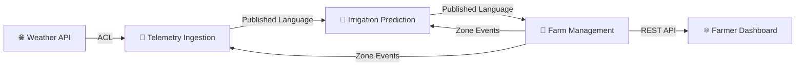
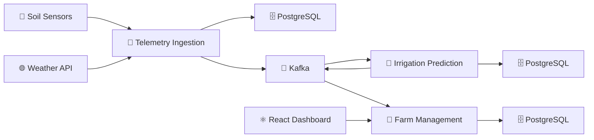

# 💧 DropSense

### Sistema de Telemetria e Decisão Agrícola Inteligente

> Projeto de estudo e portfólio voltado à aplicação prática de **Arquitetura Orientada a Eventos**, **Domain-Driven Design**, **Test-Driven Development**, **orquestração com Kubernetes** e **observabilidade**, em um ecossistema poliglota de microsserviços.

---

## 📌 Parte 1 — Visão Geral do Projeto

### 🎯 Objetivo

O **DropSense** não nasceu para resolver um problema de negócio real — ele nasceu para **estudar, na prática, como sistemas distribuídos modernos são construídos**. A ideia é simular, em escala reduzida, os mesmos desafios enfrentados por arquiteturas de produção que processam grandes volumes de eventos em tempo real, e usar esse cenário como laboratório para aplicar (e demonstrar) conceitos como:

- ⚡ **Event-Driven Architecture (EDA)** — comunicação assíncrona entre serviços via Apache Kafka, com produtores e consumidores desacoplados.
- 🧠 **Domain-Driven Design (DDD)** — modelagem de domínios ricos, agregados, invariantes de negócio e bounded contexts bem definidos.
- ✅ **Test-Driven Development (TDD)** — regras de negócio críticas cobertas por testes escritos antes (ou junto) da implementação.
- ☸️ **Kubernetes & Docker** — containerização de cada serviço e orquestração de um sistema poliglota como se fosse um ambiente produtivo real.
- 📊 **Observabilidade** — métricas, dashboards e tracing distribuído end-to-end, permitindo entender o que acontece dentro do sistema sem precisar adivinhar.
- 🌐 **Poliglotismo arquitetural** — cada linguagem usada onde ela é estruturalmente mais forte, e não por modismo.

> ⚠️ **Nota de transparência:** este é um projeto educacional/portfólio. Os dados de sensores, clima e parte das regras de negócio são simulados ou mockados propositalmente — o foco está na **arquitetura, nos padrões e nas decisões de design**, não na precisão agronômica.

---

### 🛠️ Stack Tecnológica

#### Linguagens & Frameworks


#### Mensageria & Streaming


#### Dados


#### Frontend


#### Infraestrutura & Orquestração


#### Observabilidade


---

### 🧩 Visão Rápida — Quem Faz o Quê

| Serviço | Linguagem | Papel Principal |
|---|---|---|
| **Ingestão de Telemetria** | 🐹 Go | Alta concorrência de I/O, validação primária e publicação no Kafka |
| **Motor Preditivo** | 🐍 Python | Processamento de stream + modelo de Machine Learning para decisão de irrigação |
| **Centro de Comando** | 🔷 C# / .NET / ASP.NET | Domínio de negócio (DDD), regras de SLA, estado das zonas, API para o frontend |
| **Painel do Fazendeiro** | ⚛️ React + Vite | Visualização em tempo real, cadastro de zonas e configuração de limites |

A justificativa detalhada de **por que** cada linguagem foi escolhida para seu respectivo papel, assim como o desenho formal dos tópicos do Kafka, contratos de evento e bounded contexts, será detalhada na **Parte 3 — Arquitetura**.

---

## 🌱 Parte 2 — A História por Trás do DropSense: Sistema de Captação de Dados de Umidade

### ☀️ A Fazenda e o Desafio

A **Fazenda Coador de Pano** é uma grande produtora de café especial e grãos de exportação. Com mais de **5.000 hectares** plantados, a propriedade é dividida em diversas **Zonas de Cultivo**, cada uma com necessidades hídricas próprias, dependendo do estágio da planta e do tipo de solo.

À frente da operação está o **Agrônomo-chefe**, responsável por garantir que cada hectare receba a quantidade certa de água — nem mais, nem menos. E é exatamente aí que moram os três grandes problemas que ele enfrenta todos os dias:

- 💧 **Desperdício de água e energia** — as bombas de irrigação são acionadas por horário fixo ou por intuição da equipe de campo, o que frequentemente resulta em solo encharcado (prejudicando a raiz do café) ou em energia gasta à toa, em dias que choveria à tarde mesmo assim.
- 👁️ **Falta de visibilidade** — é simplesmente impossível inspecionar manualmente a umidade de 5.000 hectares, todos os dias, em todas as zonas.
- 🐢 **Lentidão na reação** — quando uma onda de calor atinge a fazenda, a equipe leva dias para reorganizar o plano de irrigação, e nesse intervalo a lavoura já sofreu.

### 📡 Os Sensores e o Hardware (Simulados)

Para enfrentar esse cenário, a fazenda investiu pesado em IoT. Foram espalhados **10.000 sensores de solo** (nós de telemetria) por todas as zonas de cultivo.

Cada sensor, a cada **30 segundos**, emite um payload JSON contendo:

```json
{
  "sensorId": "string",
  "zonaId": "string",
  "nivelUmidadeSolo": "number (%)",
  "temperaturaSolo": "number (°C)",
  "timestamp": "datetime"
}
```

Esses sensores transmitem dados de forma incessante através de antenas de rádio **LoRaWAN**, que convertem o sinal e disparam requisições HTTP em direção à nuvem — uma enxurrada constante de dados, 24 horas por dia.

### 🧠 A Solução de Software: o Sistema DropSense

É aqui que o **DropSense** entra em ação, para orquestrar esse caos de dados e transformá-lo em decisão.

#### 🐹 O "Pára-raios" de Dados — Go

Os 10.000 sensores geram um volume de requisições que exige um serviço extremamente performático na porta de entrada. O serviço em **Go** recebe essas requisições, faz uma validação primária (descartando leituras corrompidas ou fora de padrão) e publica os dados brutos no Kafka, no tópico `telemetria.bruta`, usando goroutines e channels para absorver a carga sem travar.

Paralelamente, em intervalos regulares, esse mesmo serviço consulta uma **API externa de previsão do tempo**, buscando a probabilidade de chuva para as próximas horas, e publica essa informação em um tópico próprio no Kafka.

#### 🐍 O Cérebro Agronômico — Python

Este serviço assina os tópicos de telemetria e de previsão climática. Ele agrupa as leituras por **Zona** em janelas de tempo (por exemplo, a média de umidade da Zona A nos últimos 5 minutos) e aplica um modelo preditivo — mesmo que simplificado para fins do projeto — para responder perguntas como:

> *"A umidade atual está em 30%, mas há 80% de chance de chuva nas próximas 2 horas. Vale a pena irrigar agora?"*

A decisão resultante é publicada como um evento de comando no Kafka: `ComandoIrrigacaoCalculado` (ligar ou desligar a bomba da Zona X).

#### 🔷 O Centro de Comando — C# / .NET

O serviço em **C#** cuida da inteligência de negócio "humana" e do estado real da fazenda. Ele consome as decisões vindas do Python, mas não as executa de forma cega — antes, valida as regras de negócio de alto nível (o coração do DDD deste projeto):

- A bomba da Zona X está em manutenção?
- O reservatório de água tem volume suficiente?
- A zona está dentro do SLA de umidade configurado pelo agrônomo?

Só então o estado da zona é alterado para `Irrigando`, e alertas são gerados quando algo sai do esperado.

#### ⚛️ A Janela do Fazendeiro — React + Vite

O frontend consome os dados expostos pelo serviço em C#, exibindo um **mapa em tempo real da fazenda**. É por ali que o agrônomo cadastra novas zonas, configura os limites aceitáveis de umidade (SLAs) e acompanha gráficos de tendência — estes alimentados pelos dashboards do Grafana.

### 🤔 Por Que Essa Divisão Faz Sentido no Mundo Real

- **Go** é ideal para sustentar alta taxa de I/O de rede — milhares de requisições por segundo é exatamente o terreno onde goroutines e channels se destacam.
- **Python** é o ecossistema natural para carregar modelos de IA/ML e bibliotecas de análise de dados (Pandas, Scikit-Learn).
- **C#/.NET** brilha na modelagem de domínios complexos (DDD), em regras de transição de estado e em APIs robustas para servir o frontend.

Cada tecnologia, portanto, não está ali por modismo — está ali porque resolve melhor uma fatia específica do problema. Essa é, inclusive, a primeira decisão arquitetural que vale a pena saber defender numa entrevista.

---

## 🧠 Parte 3 - Event Storming

### 📌 Domain Events

| Evento de Domínio | Producer |
|-------------------|----------|
| `SoilReadingRegistered` | 🐹 Go |
| `WeatherForecastUpdated` | 🐹 Go |
| `IrrigationDecisionCalculated` | 🐍 Python |
| `IrrigationStarted` | 🔷 C# |
| `IrrigationRejected` | 🔷 C# |
| `IrrigationFinished` | 🔷 C# |
| `SlaBreached` | 🔷 C# |
| `ZoneRegistered` | 🔷 C# |
| `ZoneSlaLimitsUpdated` | 🔷 C# |

---

### 📡 Kafka Topics

| Topic | Events | Partition Key |
|---------|---------|---------|
| `telemetry.readings.v1` | `SoilReadingRegistered` | `sensorId` |
| `weather.forecasts.v1` | `WeatherForecastUpdated` | `zoneId` |
| `irrigation.decisions.v1` | `IrrigationDecisionCalculated` | `zoneId` |
| `irrigation.events.v1` | `IrrigationStarted`, `IrrigationRejected`, `IrrigationFinished` | `zoneId` |
| `zone.events.v1` | `ZoneRegistered`, `ZoneSlaLimitsUpdated` | `zoneId` |
| `alerts.sla.v1` | `SlaBreached` | `zoneId` |

> 💡 O sufixo `.v1` representa a versão do contrato do tópico e facilita evolução futura sem quebrar consumidores existentes.

---

### 🏗️ Bounded Contexts

| Contexto | Tipo Estratégico | Tecnologia | Responsabilidade |
|-----------|-----------|-----------|-----------|
| **Telemetry Ingestion** | Generic Subdomain | 🐹 Go | Receber leituras e previsões meteorológicas |
| **Irrigation Prediction** | Supporting Subdomain | 🐍 Python | Processar dados e calcular decisões de irrigação |
| **Farm Management** | Core Domain | 🔷 C# | Gerenciar zonas, SLAs, reservatórios e ciclos |

---

### 🔄 Context Map



---

### 🏛️ Component Diagram



---

### 📜 Event Contract Standard

Todos os eventos publicados no Kafka seguem o mesmo envelope.

#### ✨ Event Envelope

```json
{
  "eventId": "f47ac10b-58cc-4372-a567-0e02b2c3d479",
  "eventType": "IrrigationDecisionCalculated",
  "eventVersion": 1,
  "occurredAt": "2026-06-23T14:32:10Z",
  "producer": "irrigation-prediction",
  "correlationId": "b7e2a1d4-...",
  "payload": {}
}
```

---

#### 🔍 Envelope Fields

| Field | Purpose |
|---------|---------|
| `eventId` | Idempotência e rastreabilidade |
| `eventType` | Tipo do evento |
| `eventVersion` | Versão do schema |
| `occurredAt` | Timestamp de negócio |
| `producer` | Serviço emissor |
| `correlationId` | Correlação entre eventos |

---

## 🚨 EVENT CONTRACTS (SOURCE OF TRUTH)

> ⚠️ Esta seção representa o contrato oficial de integração entre todos os microserviços.

---

### 🐹 Telemetry Ingestion Events

### SoilReadingRegistered

#### Topic

```text
telemetry.readings.v1
```

#### Payload

```json
{
  "sensorId": "sensor-04812",
  "zoneId": "zone-042",
  "soilMoisturePercent": 38.5,
  "soilTemperatureCelsius": 24.1,
  "measuredAt": "2026-06-23T14:30:00Z"
}
```

#### Notes

- `measuredAt` = instante da medição
- `occurredAt` = instante da publicação
- Leituras inválidas são descartadas antes da publicação

---

### WeatherForecastUpdated

#### Topic

```text
weather.forecasts.v1
```

#### Payload

```json
{
  "zoneId": "zone-042",
  "rainProbabilityPercent": 80,
  "forecastTemperatureCelsius": 29.5,
  "forecastWindowHours": 12,
  "source": "open-meteo"
}
```

---

### 🐍 Irrigation Prediction Events

### IrrigationDecisionCalculated

#### Topic

```text
irrigation.decisions.v1
```

#### Payload

```json
{
  "zoneId": "zone-042",
  "decision": "START_IRRIGATION",
  "windowStart": "2026-06-23T14:25:00Z",
  "windowEnd": "2026-06-23T14:30:00Z",
  "averageSoilMoisturePercent": 31.2,
  "rainProbabilityPercent": 80,
  "confidenceScore": 0.74,
  "modelVersion": "v1"
}
```

#### Decision Enum

```text
START_IRRIGATION
SKIP_IRRIGATION
```

#### Highlights

✅ Janela explícita de agregação

✅ Versionamento de modelo

✅ Score de confiança

✅ Evento explicável

---

### 🔷 Farm Management Events

### IrrigationStarted

#### Topic

```text
irrigation.events.v1
```

#### Payload

```json
{
  "zoneId": "zone-042",
  "cycleId": "9f8e7d6c-...",
  "startedAt": "2026-06-23T14:31:05Z"
}
```

---

### IrrigationRejected

#### Topic

```text
irrigation.events.v1
```

#### Payload

```json
{
  "zoneId": "zone-042",
  "reason": "RESERVOIR_INSUFFICIENT_VOLUME",
  "rejectedAt": "2026-06-23T14:31:05Z"
}
```

#### Reason Enum

```text
ZONE_UNDER_MAINTENANCE
RESERVOIR_INSUFFICIENT_VOLUME
```

---

### IrrigationFinished

#### Topic

```text
irrigation.events.v1
```

#### Payload

```json
{
  "zoneId": "zone-042",
  "cycleId": "9f8e7d6c-...",
  "finishedAt": "2026-06-23T15:01:05Z",
  "durationSeconds": 1800
}
```

---

### SlaBreached

#### Topic

```text
alerts.sla.v1
```

#### Payload

```json
{
  "zoneId": "zone-042",
  "metric": "SOIL_MOISTURE",
  "observedValue": 18.4,
  "thresholdValue": 25.0,
  "breachedSince": "2026-06-23T13:50:00Z"
}
```

---

### ZoneRegistered

#### Topic

```text
zone.events.v1
```

#### Payload

```json
{
  "zoneId": "zone-042",
  "name": "North Zone - Lot 7",
  "hectares": 42.5,
  "cropType": "COFFEE",
  "soilType": "clay loam"
}
```

---

### ZoneSlaLimitsUpdated

#### Topic

```text
zone.events.v1
```

#### Payload

```json
{
  "zoneId": "zone-042",
  "minSoilMoisturePercent": 25.0,
  "maxSoilMoisturePercent": 60.0
}
```

---

### 🔗 Correlation Strategy

#### Correlation Flow

```text
IrrigationDecisionCalculated
          │
          ▼
IrrigationStarted
          │
          ▼
IrrigationFinished
```

Todos compartilham o mesmo:

```json
{
  "correlationId": "uuid"
}
```

---

### 📈 Future Evolution

Em produção, estes contratos seriam registrados em um:

- Confluent Schema Registry
- Apache Avro
- Protocol Buffers

Para este projeto educacional, este documento atua como o **Schema Registry oficial do sistema**.

---

### 🎯 Architectural Principles

- Event Driven Architecture
- Domain Driven Design (DDD)
- Database per Service
- Event-Carried State Transfer
- Published Language
- Anti-Corruption Layer
- Idempotent Consumers
- Contract First Integration
- Observability Ready (OpenTelemetry)

---
⭐ **Os eventos e payloads descritos acima são a fonte única da verdade para comunicação entre os microserviços do DropSense.**

---
> Arquitetura orientada a eventos para monitoramento inteligente de irrigação utilizando **Go**, **Python**, **C#**, **Kafka**, **PostgreSQL**, **React** e **Kubernetes**.
